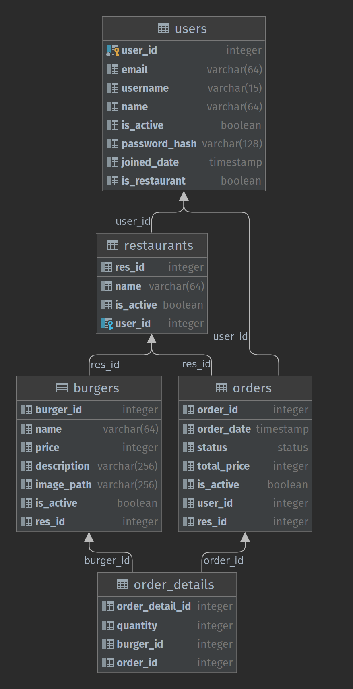

# Burgerzilla - Yemeksepeti & Patika Python Flask Egitimi Bitirme Projesi


## Ödevin İsterleri
Hamburger restoranlarından sipariş alan, siparişin durumunu görüntüleyebilen, sipariş ile ilgili müşteri/restoran yetkisinde işlemler yapmayı sağlayan bir REST-API mikro servisi. [Ödevin Pdf Dosyası](yemeksepeti-python-bootcamp-bitirme-projesi.pdf)

## Dosya Yapısı
### Genel Yapı
    ├── app
    │   ├── api                   # User ve Restaurant endpoinlerinin karşılayan kodları içeriyor.          
    │   │   ├── restaurant        # restoranın sipariş ile ilgili gelen isteklerini karşılar
    │   │   └── user              # kullanıcının sipariş ile ilgili gelen istekleri karşılar
    │   ├── auth                  # kullanıcının kayıt olmasını ve giriş yapmasını sağlayan istekleri karşılar.
    │   └── models                # kullanıcı, restoran, sipariş, sipariş detayı, burger modellerini içerir.

### Ortak Yapı
    ├── auth - restaurant - user
    │   ├── controller.py         # Gelen isteklerin route'u belirlenir. Swagger'a eklenir
    │   ├── dto.py                # Payload gereken isteklerin modelinin tanımlandığı ve swagger'a eklenmesi
    │   ├── service.py            # Gelen isteğe göre çalışan kodlar buraya yazılır
    │   └── utils.py              # Gelen verinin doğruluğunun kontrolleri yapılır

### Database Yapısı


- ### Projenin Çalıştırılması
  * #### Docker ile çalıştırmak
  ```
  docker build -t burgerzilla:latest .
  docker-compose up --build web
  ```
  Komutlarını çalıştırdan sonra api localhost:5000 den çalışmaya başlayacaktır.
- ### Swagger'a erişmek için
  ```
  localhost:5000 -> Kayıt olma ve giriş endpointleri
  localhost:500/api -> Kullanıcı ve Restoran endpointleri
  ```
- ### Kayıt ve Giriş
  * #### Kayıt olma
  ```
  localhost:5000/auth/register [POST]
  {
    "email":"ornek@gmail.com",
    "username":"ornek",
    "name":"Ornek Ornek",
    "password":"orneksifre"
  }
  json objesiyle post isteği atılması gereklidir.
  ``` 
  * #### Giriş yapma
  ```
  localhost:5000/auth/login [POST]
  {
    "email":"ornek@gmail.com",
    "password":"orneksifre"
  }
  json objesiyle post isteği atılması gereklidir.
  ``` 
  * #### Restoran kayıt
  Restoran üyeliğine çevirmek için önce normal üye olmak gereklidir. Login olduğunuzda gelen access_token ile restoran açabilirsiniz. 
  ```
  localhost:5000/auth/register/restaurant [POST]
  {
    "name": "Ornek Restoran"
  }
  json objesiyle post isteği atılması gereklidir.
  "name": Restoranın adı
  ``` 
- ### Müşterinin endpoint'leri
     Buradaki endpointlere istek atabilmek için öncelikle login olmak gereklidir. Örnek olarak kullanıcı adımız "ornek" olsun. Ornek orderId ise "1" olsun.
  * #### Müşteri Bilgilerini Görüntüleme
     Kullanıcının kendi bilgilerini görmek için 
  
     localhost:5000/api/**<kullanıcıAdı>** [GET]
  ```
  localhost:5000/api/ornek adresine [GET]
  isteği atılması gerekir.
  ```
  * #### Sipariş oluşturma
     Kullanıcının sipariş vermesi için
  
     localhost:5000/api/**<kullanıcıAdı>**/orders [POST]
  ```
  localhost:5000/api/ornek/orders adresine [POST]
  {
  "burgers":[
        {
            "burger_id": 4,
            "quantity": 1
        },
        {
            "burger_id": 5,
            "quantity": 4
        }
    ]
  }
  json objesiyle post isteği atılması gereklidir.
  "burgers": Siparişte seçilmiş olan burgerlerin listesi
  "burger_id": Seçilmiş olan burgerin id'si
  "quantity": Burgerden kaç tane seçildiği
  ``` 
  * #### Siparişin detayı
     Kullanıcının vermiş olduğu siparişin detayını görüntüleyebilmesi için 
  
     localhost:5000/api/**<kullanıcıAdı>**/order/<**orderId**> [GET]
  ```
  localhost:5000/api/ornek/order/1 adresine [GET]
  isteği atılması gerekir.
  ``` 
  * #### Sipariş güncelleme
     Kullanıcının siparişindeki hamburger sayısını değiştirmek   
  
     localhost:5000/api/**<kullanıcıAdı>**/order/<**orderId**> [PUT]
  ```
  localhost:5000/api/ornek/order/1 adresine [PUT]
  {
     "burger_id": 5,
     "quantity": 4
  }
  json objesiyle put isteği atılması gereklidir.
  "burger_id": Seçilmiş olan burgerin id'si
  "quantity": Burgerden kaç tane seçildiği
  ``` 
  * #### Siparişleri listeleme
     Kullanıcının vermiş olduğu aktif tüm siparişleri görüntülemek.
  
     localhost:5000/api/**<kullanıcıAdı>**/orders [GET]
  ```
  localhost:5000/api/ornek/orders adresine [GET]
  isteği atılması gereklidir.
  ``` 
  * #### Siparişi iptal etme
     Kullanıcının siparişini iptal etmek için
  
     localhost:5000/api/**<kullanıcıAdı>**/order/<**orderId**> [DELETE]
  ```
  localhost:5000/api/ornek/order/1 adresine [DELETE]
  isteği atılması gereklidir.
  ``` 
- ### Restoranın endpoint'leri
    Buradaki endpointlere istek atabilmek için **Restoran hesabıyle giriş yapılmalıdır.** Örnek restoran id'si için "1" kullanılacaktır. Örnek order id'si için "1" kullanılacaktır.

    Tüm restoranları listeleme ve seçilen restoranın menüsünü görüntelemek hariç.
  * #### Tüm Restoranları Listeleme
     Aktif olan tüm restoranları listelemek için 
  
     localhost:5000/api/restaurant [GET]
  ```
  localhost:5000/api/restaurant adresine [GET]
  isteği atılması gerekir.
  ``` 
  * #### Seçilen Restoranın Menüsünü Görüntüleme
     Seçilen restoranın menüsünün görüntülemek için 
  
     localhost:5000/api/restaurant/<**restoranId**>/menu [GET]
  ```
  localhost:5000/api/restaurant/1/menu adresine [GET]
  isteği atılması gerekir.
  ``` 
  * #### Restoran Siparişleri listeleme
     Sahibi olduğunuz restoranın aktif siparişlerini görüntülemek için 
  
     localhost:5000/api/restaurant/<**restoranId**>/orders [GET]
  ```
  localhost:5000/api/restaurant/1/orders adresine [GET]
  isteği atılması gerekir.
  ``` 
  * #### Restoran Siparişin detayı
     Seçilen aktif siparişin detaylarını görüntülemek için 
  
     localhost:5000/api/restaurant/<**restoranId**>/order/<**orderId**> [GET]
  ```
  localhost:5000/api/restaurant/1/order/1 adresine [GET]
  isteği atılması gerekir.
  ``` 
  * #### Restoran Siparişi iptal etme
     Seçilen siparişi iptal etmek için
  
     localhost:5000/api/restaurant/<**restoranId**>/order/<**orderId**> [DELETE]
  ```
  localhost:5000/api/restaurant/1/order/1 adresine [DELETE]
  isteği atılması gerekir.
  ``` 
  * #### Restoran Sipariş Güncelleme
     Restoranın siparişinin durumunu değiştirmesi için   
  
     localhost:5000/api/restaurant/<**restoranId**>/order/<**orderId**> [PUT]
  ```
  localhost:5000/api/restaurant/1/order/1 adresine [PUT]
  {
     "status_id':2
  }
  json objesiyle put isteği atılması gereklidir.
  "status_id": Güncellenecek durumun id'si. 
  0: NEW, 1: PREPARING, 2: ON THE WAY, 3: DELIVERED, 4: RES_CANCELLED, 5: CUSTOMER_CANCELLED
  ``` 
  * #### Menüye ürün ekleme
     Restoranın menüsüne yeni bir hamburger ekleyebilmesi için   
  
     localhost:5000/api/restaurant/<**restoranId**>/menu [POST]
  ```
  localhost:5000/api/restaurant/1/menu adresine [POST]
  {
     "name": "Enfes Burger,
     "price": 20,
     "description": "En lezzetli burger",
     "image_path": "path/enfes_burger"
  }
  json objesiyle put isteği atılması gereklidir.
  "name": Hamburgerin adı
  "price": Hamburgerin fiyatı
  "description": Hamburgerin açıklaması
  "image_path": Hamburgerin görselinin yolu
  ``` 
  * #### Menüdeki ürünü güncelleme
     Restoranın menüdeki hamburgeri özelliklerini güncellemek için. Örnek burger id'si "1" olarak kullanılacaktır.
  
     localhost:5000/api/restaurant/<**restoranId**>/menu/<**burgerId**> [PUT]
  ```
  localhost:5000/api/restaurant/1/menu/1 adresine [PUT]
  {
     "name": "Enfes Burger,
     "price": 50,
     "description": "En lezzetli burger",
     "image_path": "path/enfes_burger",
     "is_active": true
  }
  json objesiyle put isteği atılması gereklidir.
  "name": Hamburgerin adı
  "price": Hamburgerin fiyatı
  "description": Hamburgerin açıklaması
  "image_path": Hamburgerin görselinin yolu
  "is_active": Hamburger aktiflik durumu [true, false]
  ``` 
  * #### Menüdeki ürünün detayını görüntüleme
     Menüdeki ürünün detayını görüntelemek için
  
     localhost:5000/api/restaurant/<**restoranId**>/menu/<**burgerId**> [GET]
  ```
  localhost:5000/api/restaurant/1/menu/1 adresine [GET]
  isteği atılması gerekir.
  ``` 
  * #### Menüden ürün silme
     Menüden seçilen hamburgeri silmek için
  
     localhost:5000/api/**<kullanıcıAdı>**/menu/<**burgerId**> [DELETE]
  ```
  localhost:5000/api/ornek/menu/1 adresine [DELETE]
  isteği atılması gereklidir.
  ```

Bu eğitimi düzenleyen Yemeksepeti ve Patika ekiplerine, eğitim süresi boyunce enerjisi hiç düşmeyen sevgili [İbrahim](https://github.com/ibrahimediz) hocamıza ve eğitimin sonuna kadar beraber geldiğim arkadaşlarım teşekkür ederim :)
